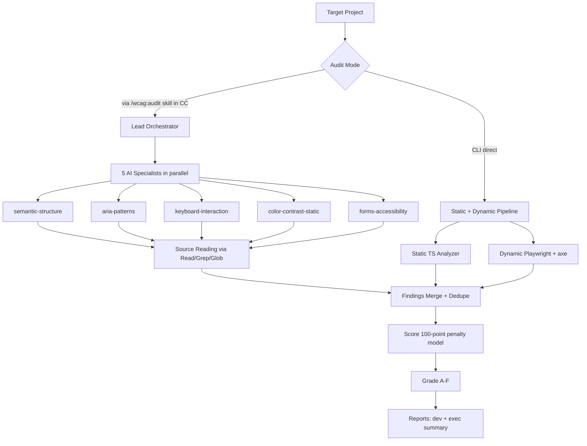
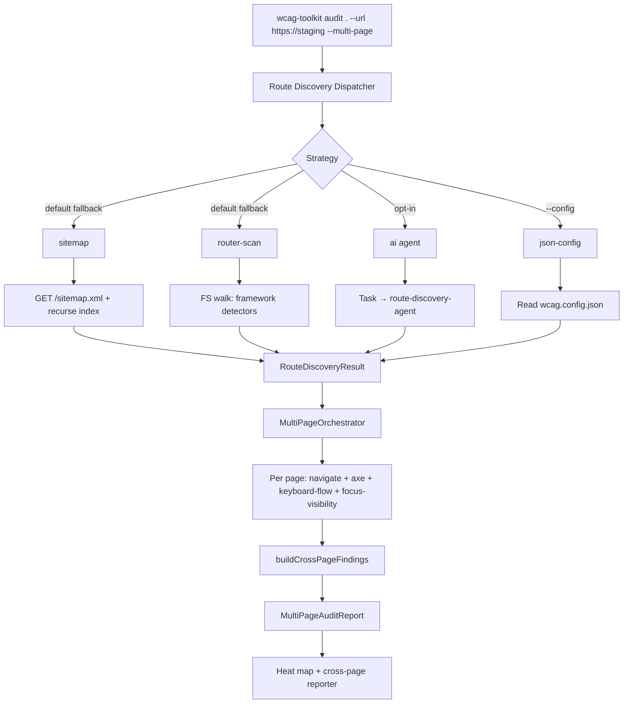
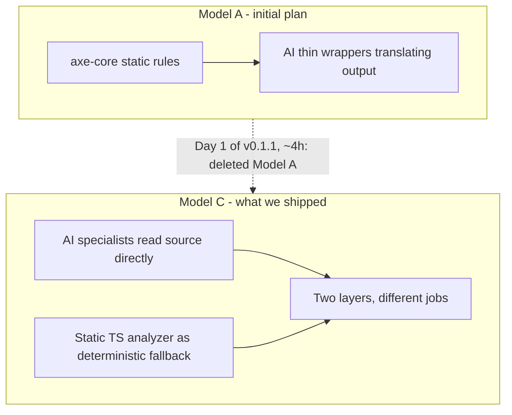

# Architecture

> Status: v0.4 (unreleased). Multi-page audit + 4-strategy route
> discovery added on top of the v0.3 AI specialists / Lead
> orchestrator foundation. v0.2 static + dynamic + reporter
> remain unchanged.

## Shape

`sdet-wcag-toolkit` is a pnpm monorepo. Each package has a single
responsibility and its own semver, so they can be published and consumed
independently.

```
packages/
├── core/                    shared types, WCAG catalog, severity, scoring, grading,
│                             MultiPageAuditReport / CrossPageFinding (v0.4)
├── static-analyzer/         AST/CSS analysis of source (HTML/CSS deterministic path);
│                             .astro / .vue / .svelte recognised in v0.4
├── dynamic-tester/          Playwright + axe-core browser checks (v0.2+),
│                             MultiPageOrchestrator + cross-page dedup (v0.4)
├── reporter/                markdown / JSON / exec summary; multi-page heat-map report (v0.4)
├── route-discovery/         v0.4 - dispatcher + 4 strategies (sitemap, router-scan, ai, json-config)
├── runtime-core/            v0.3 - RuntimeAdapter, JSON parser, HardGuard, 5 prompts
├── runtime-claude-code/     v0.3 - CC adapter via Task tool
├── orchestrator/            v0.3 - LeadOrchestrator (parallel dispatch + dedupe + score)
└── cli/                     wcag-toolkit entry point (--use-ai, --multi-page in v0.4)
```

## Data flow (legacy v0.2 view)

```
source code + optional URL
        │
        ▼
┌──────────────────────┐     ┌──────────────────────┐
│ static-analyzer      │     │ dynamic-tester       │
│  - semantic          │     │  - axe-runner        │
│  - aria              │     │  - keyboard-flow     │
│  - keyboard          │     │  - focus-visibility  │
│  - contrast          │     │                      │
└─────────┬────────────┘     └──────────┬───────────┘
          │                             │
          └──────────────┬──────────────┘
                         ▼
                WcagFinding[] (core types)
                         │
                         ▼
                   reporter
                         │
                         ▼
              markdown / JSON / exec summary
```

All analyzers emit the same `WcagFinding` shape, so merging static + dynamic
findings is a simple concat + dedupe by `(successCriterion, location)`.

---

## v0.3 high-level pipeline

The v0.3 audit chains three sources into one report. The AI tier
runs only inside a Claude Code session (the Task tool isn't available
in a Bash subprocess); the static + dynamic tiers always run.



Each AI specialist owns one WCAG domain and reads framework source
directly via `Read` + `Grep` + `Glob` - no axe-core wrapping, no
LLM-translates-deterministic-output indirection. The Lead orchestrator
is pure dispatch + dedupe by `(ruleId, file:line, url)` + severity-
weighted score aggregation. Grade is score-derived (A: 90+, B: 75-89,
C: 50-74, D: 25-49, F: <25), so it scales with severity rather than
finding count.

## v0.4 multi-page pipeline

`--multi-page` plugs a discovery layer in front of the dynamic
tester and a deduper after it. The discovery dispatcher tries
strategies in a fallback chain (default `sitemap → router-scan →
json-config`); explicit `--strategy=<name>` pins one. AI is
opt-in (`--use-ai` or `--strategy=ai`) to avoid surprise token
spend.



Discovery returns a `RouteDiscoveryResult` regardless of which
strategy ran - `routes`, `strategy`, `confidence` (0..1), and
`warnings`. The orchestrator iterates routes sequentially against
one Playwright browser (started once, navigated per page, torn down
at the end), records skips for dynamic-no-sample / runner-error /
max-pages, and feeds the resulting `PageAuditResult[]` through the
cross-page deduper. Findings group by `(ruleId, file:line)` for
source-located, `(ruleId, selector)` for DOM-located, with a
fallback by message; the canonical finding is the first occurrence
and `affectedPages` lists every URL where it appeared. The reporter
uses that count to surface the **single fix → many pages green**
narrative.

`--max-pages` is enforced by the orchestrator (counts only audited
pages, not skips) and `--dry-run` bails out after discovery before
the browser launches. `audit.baseUrl` from `wcag.config.json` is
honored when `--url` is omitted, so a project with a config file
can `wcag-toolkit audit . --multi-page` and have everything wired.

## Tier comparison

What's in the public toolkit, what's gated to Pro, and what's
on the roadmap.

```mermaid
graph LR
    subgraph Public["Public v0.4 (AGPL-3.0)"]
        A1[Static TS]
        A2[Dynamic Playwright]
        A3[5 AI Specialists]
        A4[Lead Orchestrator]
        A5[A-F Grading]
        A6[/wcag:audit skill]
        A7[Multi-page 4-strategy discovery]
        A8[Cross-page dedup + heat map]
    end

    subgraph Pro["Pro V0.4 alpha.3 (Commercial)"]
        B1[Everything from Public]
        B2[Multi-runtime CC/OpenCode/Ollama]
        B3[Auto-fix Engine 2 patchers]
        B4[wcag.config.ts]
    end

    subgraph Pro4["Pro V0.4 alpha.4 (planned)"]
        C1[+modal-specialist]
        C2[+ecommerce-journey]
        C3[Per-page traces + screenshots]
        C4[Authenticated routes]
        C5[Parallel BrowserContexts]
        C6[Per-route specialist routing]
    end

    subgraph Enterprise["Pro V0.5 Enterprise (planned)"]
        D1[Cross-repo via jarvis-brain]
        D2[Design System Federation]
        D3[Three audit modes]
        D4[Deep dedupe semantic]
    end

    Public -.imports.-> Pro
    Pro --> Pro4
    Pro4 --> Enterprise
```

Public is intentionally a working subset of Pro: the 5 specialists,
the Lead orchestrator, and the grading band live in this repo and
ship under AGPL-3.0. Pro extends the runtime layer (OpenCode +
Ollama for offline / local-first contexts), adds the auto-fix engine
(codemods with verifier loop + rollback on regression), and bundles
two niche specialists for modal flows and e-commerce journeys. Pro
V0.5 lifts cross-repo audits and design-system federation onto the
jarvis-brain orchestrator. See [sdet.it/services](https://sdet.it/services)
for commercial licensing.

## Pivot architecture story

The shipping shape isn't what was on the napkin in November 2025.



Model A was the obvious shape: axe-core handles deterministic rules,
LLM specialists wrap axe output and "explain" it. After ~4h of
prototyping it became clear that path adds nothing axe-core doesn't
already do - and worse, the LLM specialists had no independent
intelligence beyond rephrasing. Model C inverts the relationship:
each AI specialist is a domain expert reading framework source
directly (JSX, Vue SFC, Angular templates, Svelte, Astro, HTML),
emitting WcagFinding JSON, while the deterministic TS analyzer
stays as a CI-friendly fallback for plain HTML/CSS. Two layers,
different jobs, no overlap. See `docs/sprints/v0.1-sprint-report.md`
for the full pivot narrative.

## Skill design pattern (lesson from v0.3 patch)

`/wcag:audit` (in `.claude/skills/`) is the orchestration entry point
for the v0.3 audit pipeline. The critical design decision: skill
`SKILL.md` instructs CC to dispatch the `Task` tool DIRECTLY from its
own session, then call the CLI subprocess for deterministic-only
analysis (static + dynamic). The skill is the orchestrator; the CLI
is the deterministic engine.

**Anti-pattern (regression caught 2026-04-28):** routing AI dispatch
through the CLI subprocess. The CLI's `--use-ai` flag attempts to
look up `globalThis.Task` inside Node, where it doesn't exist -
result: silent agent failure, audit falls through to static + dynamic
only. The fix is one-file (`SKILL.md` only, no code changes): change
orchestration order so CC dispatches Task in-session, then runs the
CLI for static + dynamic.

The lesson generalizes: **skills are orchestration documents, the
CLI is the deterministic engine - don't mix the two layers.** Bash
subprocess loses Task context, so the CLI shouldn't try to be the
Task entry point. See `docs/sprints/v0.3-skill-refactor-patch.md`
for the full patch report.
